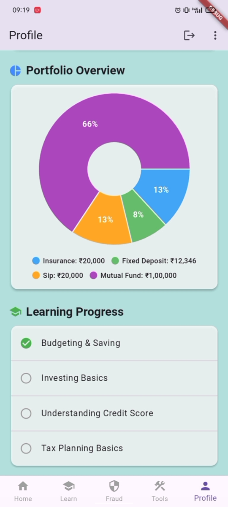
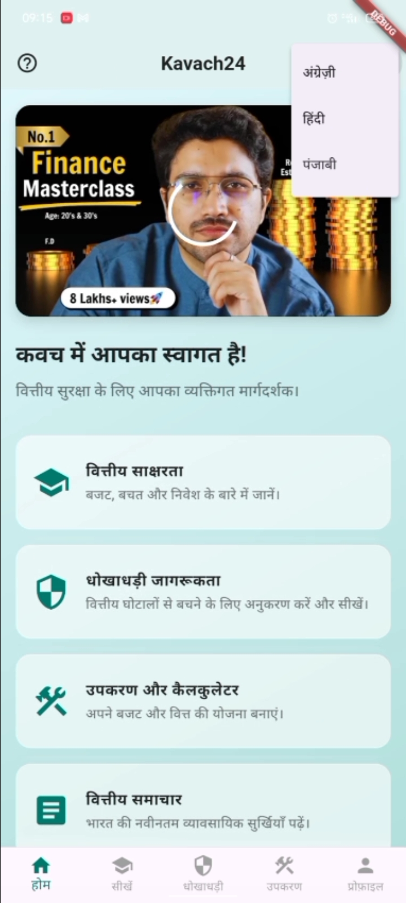

<h1 align="center">🛡 KAVACH Application</h1>

A Flutter-Based Security & Protection Mobile Application

<b>Cross-Platform • Secure • Multilingual</b>

---

<h2>📌 Overview</h2>

<b>KAVACH</b> is a mobile security and protection application developed using 
<b>Flutter</b> and <b>Dart</b>. The application provides a secure, responsive, 
and user-friendly experience through a modern cross-platform interface.

The app focuses on delivering protection-based services while ensuring 
smooth performance, structured navigation, and <b>multilingual accessibility</b> 
for users from different language backgrounds.

---

<h2>🎯 Objectives</h2>

<ul>
<li>Develop a secure cross-platform mobile application</li>
<li>Provide a responsive and user-friendly interface</li>
<li>Enable multilingual accessibility for diverse users</li>
<li>Ensure efficient data handling and validation</li>
<li>Deliver scalable and reliable mobile performance</li>
</ul>

---

<h2>✨ Key Features</h2>

<ul>
<li>📱 Cross-platform development (Android & iOS)</li>
<li>🌐 Multilingual application interface</li>
<li>⚡ Fast performance using Flutter framework</li>
<li>🎨 Modern and intuitive UI design</li>
<li>🔐 Secure and structured application flow</li>
<li>📊 Efficient state and data management</li>
<li>🛠 Error handling and validation mechanisms</li>
</ul>

---

<h2>🛠 Technologies Used</h2>

<ul>
<li>💙 Flutter Framework</li>
<li>🎯 Dart Programming Language</li>
<li>📱 Android Studio</li>
<li>💻 Visual Studio Code</li>
<li>📦 Flutter SDK</li>
</ul>

---

<h2>📱 Application Screens</h2>

<h3>🔐 Login Window</h3>

<h3>🏠 Home Page</h3>

<h3>📊 Information Page</h3>

<h3>📰 News Section</h3>

<h3>👤 Profile Section</h3>

<h3>🧮 EMI Calculator</h3>

<h3>🌍 Multilingual Support</h3>

<h3>🧠 Quiz Page</h3>

---

<h2>🏗 Application Architecture</h2>

<ol>
<li>User interacts with the Flutter UI</li>
<li>Dart handles application logic and state management</li>
<li>Data processing and validation occur internally</li>
<li>Results and responses are displayed dynamically</li>
</ol>

---

<h2>🚀 How to Run the Project</h2>

<ol>
<li>Install <b>Flutter SDK</b> from the official website</li>

<li>Install <b>Android Studio</b> or <b>Visual Studio Code</b> with Flutter and Dart extensions</li>

<li>Verify Flutter installation</li>
</ol>

<pre>
flutter doctor
</pre>

<ol start="4">
<li>Clone the repository</li>
</ol>

<pre>
git clone https://github.com/AnnayaSingh/Kavach.git
</pre>

<ol start="5">
<li>Navigate to the project directory</li>
</ol>

<pre>
cd Kavach
</pre>

<ol start="6">
<li>Install dependencies</li>
</ol>

<pre>
flutter pub get
</pre>

<ol start="7">
<li>Run the application</li>
</ol>

<pre>
flutter run
</pre>

<ol start="8">
<li>Ensure an emulator or physical device is connected</li>
</ol>

---

<h2>🔮 Future Enhancements</h2>

<ul>
<li>Cloud database integration</li>
<li>Real-time notifications</li>
<li>Advanced security features</li>
<li>UI/UX improvements</li>
<li>Analytics dashboard</li>
</ul>

---

⭐ If you like this project, consider giving it a star on GitHub!

